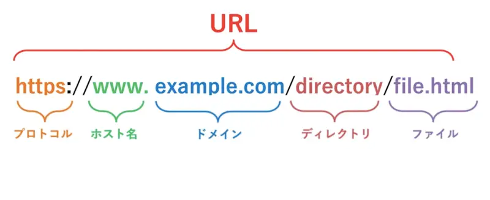

# __HTMLにまつわる用語について__

1. URLについて  
***
2. クエリ文字列について
***
3. HTTPメソッドとは何か
  * GET  
  * POST  
  * PUT  
  * PATCH  
  * DELETE  
***  
4. HTTPステータスコードについて
  * -200
  * -201
  * -400
  * -404
  * -500  
***  
5. リクエストヘッダーとは何かについて調べてみて下さい。
6. リクエストボディとは何か
7. レスポンスボディとは何か
8. JSONとは何か

# __URLについて__

URLとは __「Uniform Resource Locator」__ の略称で、インターネット上に存在する情報資源（文章や画像など）の場所を指し示す技術方式。  
簡単に言えばインターネットにおける住所です。アドレスとも呼ばれます。  
通常 __「プロトコル://ドメイン名/ディレクトリパス名/ファイル名」__ という形式で構成されます。  

例）  
 

# __クエリ文字列について__

クエリ文字列「query string」とはwebブラウザなどがwebサーバーに送信するデータを、送信先を指定するURLの末尾に特定の形式で表記したもの。　
URLの末尾に「？」を付け、続けて「名前＝値」の形式で内容を記述する。  
値が複数あるときは「＆」で区切り「？名前１＝値１＆名前２＝値２＆名前３＝値３」のように続ける。　 
# パスパラメーター（パス変数）とは〜クエリパラメータとの違い〜  
## 見た目の違い   
  
__1.https:// qiita.com/ search__  
__2.https:// qiita.com/search?q=pathparameter__  
1のパスパラメータは「search」の部分になる。
２の場合は、パスパラメータは１と同じく「search」、クエリパラメータは「?q=pathparameter」  
  
## 中身の違い　　  
  
例：株式会社アニメ（ドメイン：Anime.co.jp）に営業部(sales)があり、チームが以下のように分かれているとする。  
  
SalesTable  

| id  | name     |  
| --- | -------- |  
| 1   | Isono    |  
| 2   | Doraemon | 

チームの中のユーザーは以下の通り  
  
UsersTable  
  
| id | sales_id | name     |  
| -- | -------- | -------- |  
| 1  | 1        |  sazae   |
| 2  | 1        | kathuo   |
| 3  | 1        | wakame   |
| 4  | 2        | nobita   |
| 5  | 2        | doraemon |
| 6  | 1        | namihei  |
  
営業部のIsono(磯野)チームのページを表示するとURLは以下のようになる。  
  
__http:// Anime.co.jp/sales/{group_id}__
  
「パスパラメータ」は __特別なもの（画像など）を表示したいときに必要になります。__　　
  
__//IsonoチームのSalesTableは「１」__  
__http:// Anime.co.jp/sales/1__  
もし、メンバー一覧を画面に表示したい場合は、下記のURLとする。 __(表示)__  
__http:// Anime.co.jp/sales/1/members__  
「クエリパラメータ」は __特定のもの（画面など）に条件を加える場合に必要になります。__  

例：上記のメンバー一覧から特定の人を検索したい場合（今回はID検索と想定）  
「wakame」の検索をします。__（条件の追加）__  
  
__http:// Anime.co.jp/sales/1/members?__ __id=3__  
  
  __パスパラメータ　特定のものを判別する際に必要__  
  __クエリパラメータ 特定のものに条件を追加する際に必要__  
  
  
  
  
  
# __HTTPメソッドとは何か__

## HTTPメソッドとは、対象のリソースに対して「何をしたいか」を支持する。  
HTTPメソッドにはおおまかにGET、POST、PUT、PATCH、DELETEがある。  
  
## __GETについて__  
***

URLで指定した情報を要求しURLがファイル名のときはそのファイルの中身を、プログラム名のときはそのプログラムの出力を返す。  
  
例：googleでjavaについて検索した。 __（googleでjavaについて情報を要求した。）__  
GETメソッドはURLに追記されて値を送ります。（公開されている）

## __POSTについて__  
***  
URLで指定した情報を送り内容をBody部に格納する。  
  
例：Amazonでクレジットカードにてカード情報を入力した。 __（Amazonでカード情報を値の見えないwebサーバーに送った。）__  
POSTに関しては要求を封筒に入れて送信する。開封しないと見えない（非公開）  

  
## GETとPOSTの違い
***
__GETメソッドはURLの後ろに値が表示されます。__  
__POSTメソッドは値を見えないところに隠して送りますのでその為、URLには表示されません。__  
/PUT/PATCH/DELETE
HTTPステータスコードとは何か
下記のHTTPステータスコードの意味を調べよ
-200
-201
-400
-404
-500
リクエストヘッダーとは何かについて調べてみて下さい。
リクエストボディとは何か
レスポンスボディとは何か、JSONとは何か
